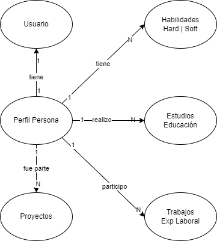
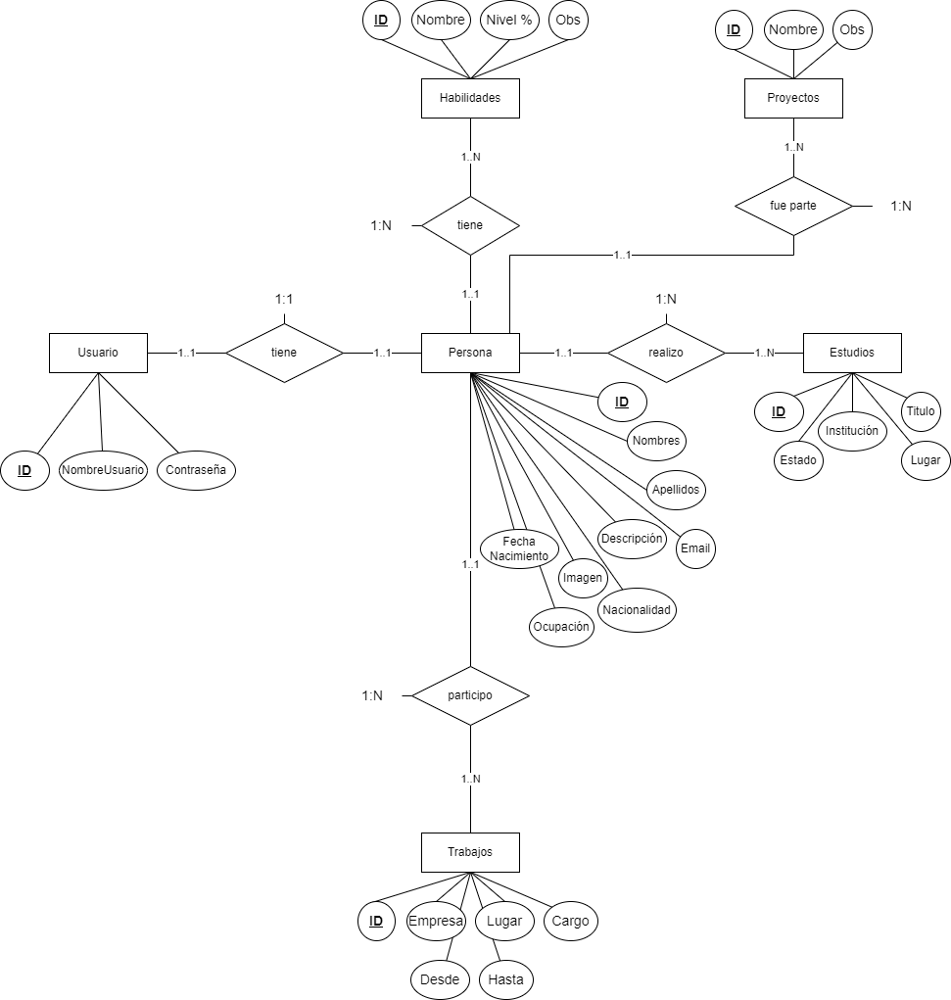

# Backend proyecto Argentina Programa

Este repositorio es parte de la entrega final del curso de programación `Argentina Programa #YoProgramo`.

Aquí está hosteado el proyecto en vivo:

* Frontend: [link](https://portfolio-e8aa4.web.app/) o [link alternativo](https://portfolio-e8aa4.firebaseapp.com/).
* Backend: [link](https://backendproyectoargprog.onrender.com)

Está hecho con Java 11, Spring y Mysql utilizando gitflow.

## Deploy CI-CD

Se hace automáticamente con una acción de github cuando se suben código a la rama principal (main).
La misma está dividida en dos etapas:

* Staging: Se construye el proyecto y corre todos los test. Si no ocurre ningún error, inicia la etapa del deploy.
* Deploy: Render sigue los pasos del dockerfile y construye el proyecto una última vez con los parámetros de
  producción, genera la imagen y corre el container.

## Planificación inicial - diseño

* Diagrama conceptual:

* Diagrama entidad-relación:

## To-Do / Mejoras

* ~~Agregar tests.~~
* Agregar la capacidad de que la persona agregue redes sociales.
* Agregar la capacidad de que la persona agregue una imagen de perfil.
* Normalizar "lugar".
* Agregar el grado de los estudios (primaria, secundaria, etc).
  